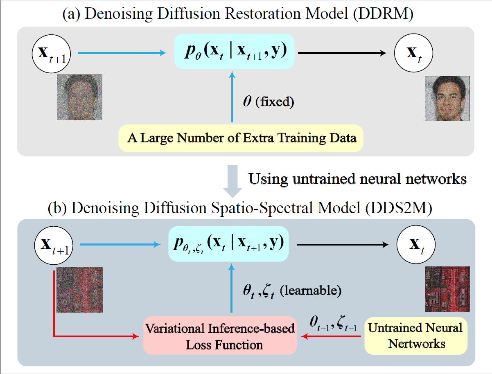

# DDS2M: Self-Supervised Denoising Diffusion Spatio-Spectral Model for Hyperspectral Image Restoration
This repository contains the code for the paper 

**[DDS2M: Self-Supervised Denoising Diffusion Spatio-Spectral Model for Hyperspectral Image Restoration][1]**  
[Yuchun Miao][myc], [Lefei Zhang][zlf], [Liangpei Zhang][zlp], [Dacheng Tao][tdc]   
Accepted by ICCV 2023

<div align="center">
  
</div>

## Installation
Clone this repository:
```
git clone git@github.com:miaoyuchun/DDS2M.git
```

The project was developed using Python 3.7.10, and torch 1.12.1.
You can build the environment via pip as follow:

```
pip3 install -r requirements.txt
```

## Running Experiments
We provide code to reproduce the main results on HSI completion, HSI denoising, and HSI super-resolution as follows:
```
python main_completion.py
python main_denoising.py
python main_sisr.py
```
More instruction about this code will be added soon!!!

## Citation and Acknowledgement
If you find our work useful in your research, please cite:

```
@article{miao2023dds2m,
  title={DDS2M: Self-Supervised Denoising Diffusion Spatio-Spectral Model for Hyperspectral Image Restoration},
  author={Miao, Yuchun and Zhang, Lefei and Zhang, Liangpei and Tao, Dacheng},
  journal={arXiv preprint arXiv:2303.06682},
  year={2023}
}
```

the code is highly based on the repository of [DS2DP](https://github.com/miaoyuchun/DS2DP), [DDRM](https://github.com/bahjat-kawar/ddrm), and [DDPM](https://github.com/lucidrains/denoising-diffusion-pytorch).


[1]: https://arxiv.org/abs/1701.06487
[myc]: https://scholar.google.com/citations?user=-ec3mwUAAAAJ&hl=en
[zlf]: https://scholar.google.com/citations?user=BLKHwNwAAAAJ&hl=en
[zlp]: https://scholar.google.com/citations?user=vzj2hcYAAAAJ&hl=en
[tdc]: https://scholar.google.com/citations?user=RwlJNLcAAAAJ&hl=en
